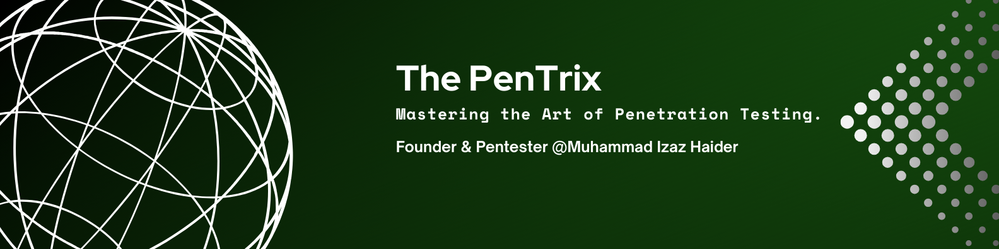
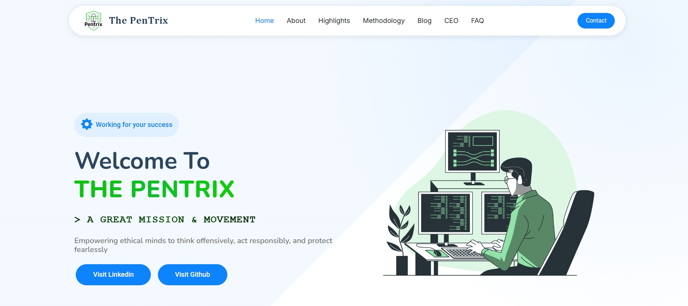
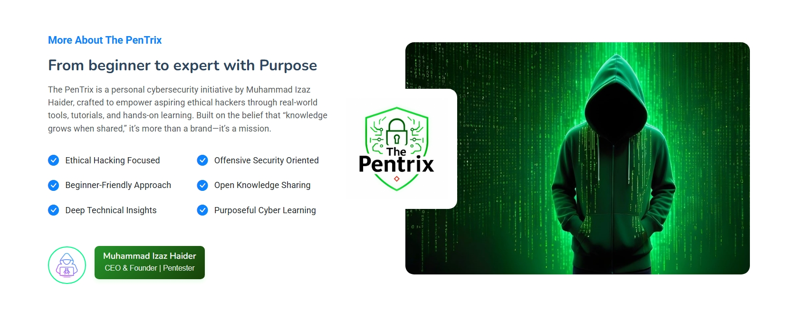
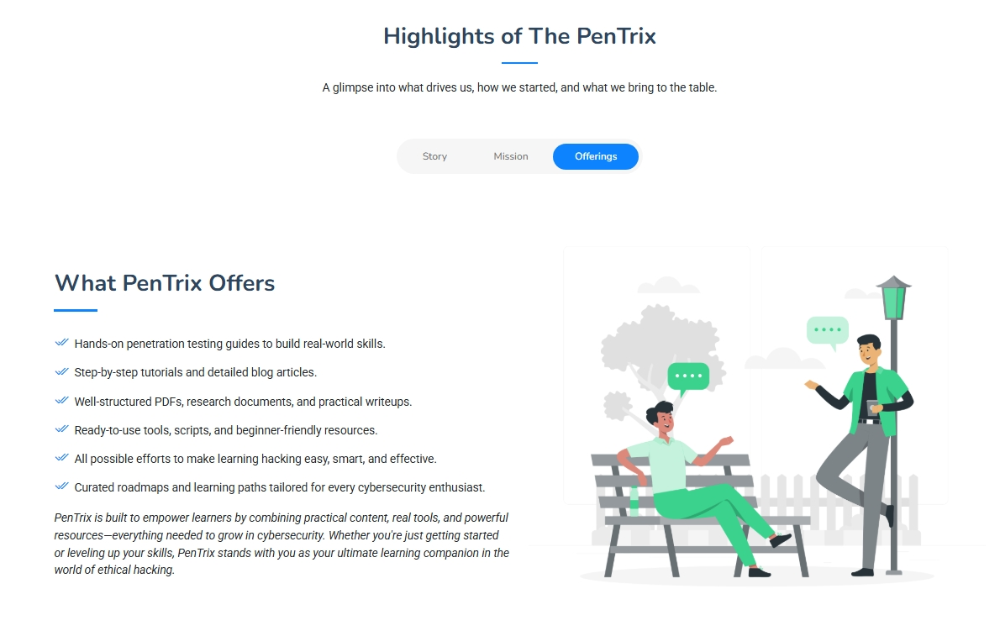
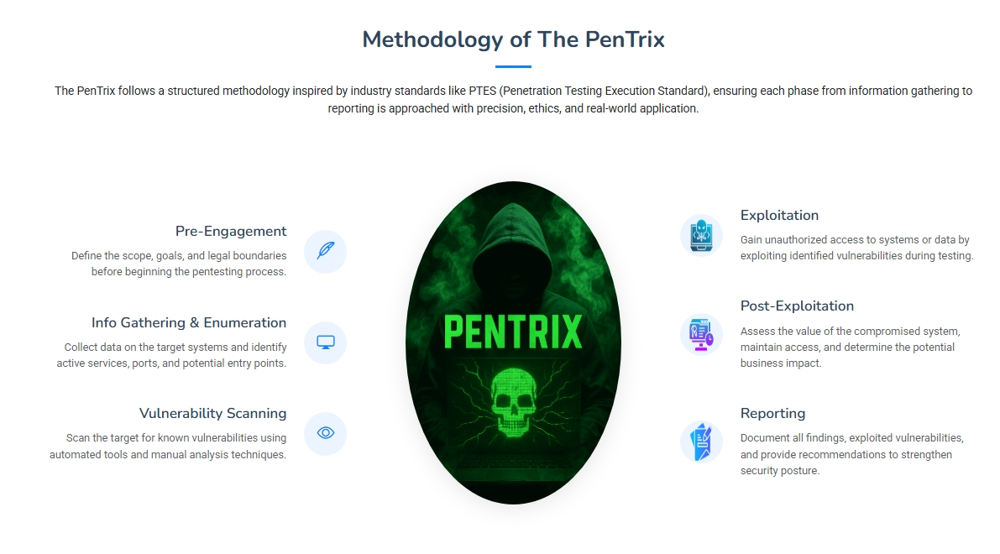
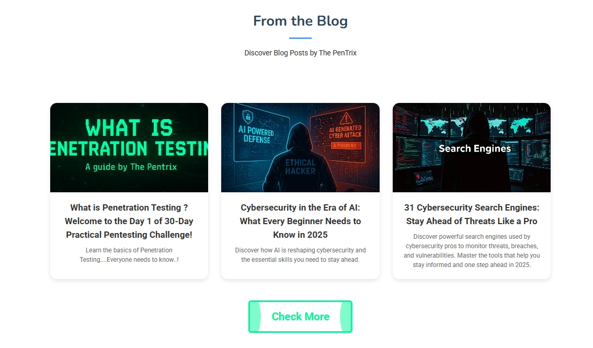
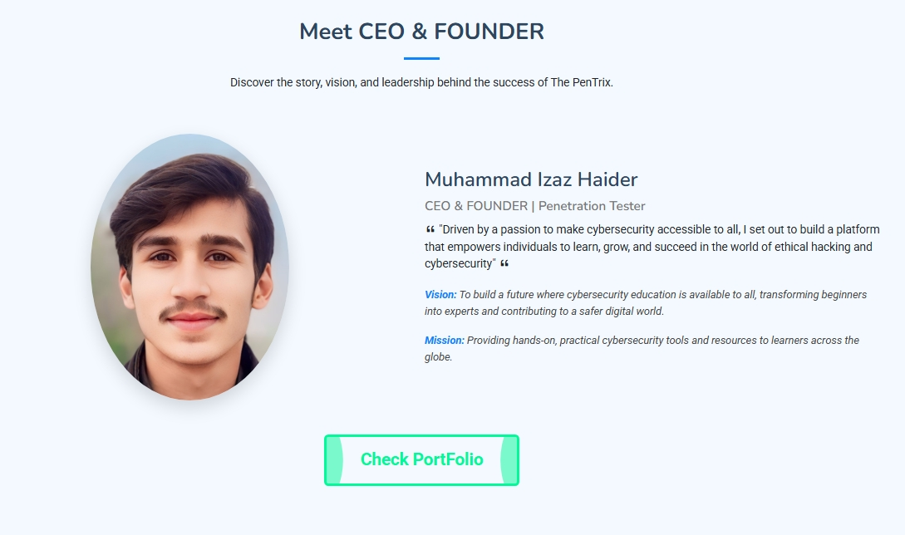

# **🔥 The PenTrix 🔥**

Welcome to **The PenTrix**  not just a website, but a **movement** born out of passion, perseverance, and the pursuit of cyber excellence. It’s a home for learners, hackers, creators, and digital defenders who want to grow, explore, and lead the world of cybersecurity with ethics and intelligence.

## 🔗 **Live Website 🌐 [Visit The PenTrix](https://mizazhaider-ceh.github.io/The-PenTrix)**

## 📖 **The Story Behind The PenTrix**

In a quiet village of Punjab, Pakistan, a young and curious soul named **Muhammad Izaz Haider** fell in love with computers. Despite limited resources, he spent countless days (and nights) exploring, experimenting, failing, and growing. With no access to professional tools or mentors, he relied on self-learning, online courses, and pure determination to master the skills of  **ethical hacking, web development, and digital security** .

What began as a personal dream soon transformed into a greater purpose — **to educate and inspire others** who are walking the same path. That purpose gave birth to **The PenTrix** — a handcrafted digital platform built entirely from scratch with real experience, practical knowledge, and a heart full of passion.

Today, The PenTrix stands as a symbol of what’s possible when  **talent meets hard work** , especially in the world of cybersecurity.

## 🎯 **Our Mission**

To  **democratize cybersecurity education** , spread  **awareness about ethical hacking** , and build a **collaborative community** where learners can grow into leaders.

We aim to:

✅ **Educate** young minds, students, and tech enthusiasts with real, actionable knowledge.

✅ **Empower** people from all backgrounds to explore cybersecurity careers.

✅ **Enable** access to high-quality resources, labs, blogs, and hacking tools.

✅ **Promote** ethical practices and responsible digital behavior.

✅ **Create** a strong learning ecosystem powered by trust, transparency, and talent.

## 🚀 **Project Overview**

> “Built with love, skill, and late-night dedication — The PenTrix is a badge of effort and evolution.”

The PenTrix is more than a static website. It’s a **fully responsive, dynamic, and educational platform** designed to make cybersecurity more  **approachable, understandable, and inspiring** .

Explore tutorials, discover tools, learn step-by-step techniques, and follow structured paths toward mastering the art of ethical hacking.

## **About Section**

## **Highlights Section**

## **Methodology Section**

## **Blog Section**

## **CEO Section**

## 📣 **Call to Action**

🚀 **The PenTrix is just the beginning.** We’re building a movement — and  **you’re invited to be part of it** .

### ✅ **How You Can Support:**

* ⭐ **Star** this project on GitHub.
* 📢 **Share** this website with your friends and cybersecurity groups.
* 💬 **Give Feedback** to help us grow stronger.
* 🤝 **Collaborate** with us if you’re a cybersecurity enthusiast, blogger, or developer.
* 🔔 **Follow** for updates, tools, and new tutorials.

## 📬 **Contact**

* 📧 Email: [mizazhaiderceh@gmail.com](mailto:mizazhaiderceh@gmail.com)
* 💼 LinkedIn: [Muhammad Izaz Haider](https://www.linkedin.com/in/muhammad-izaz-haider-091639314/)
* 🐱 GitHub: [ThePenTrix](https://github.com/mizazhaider-ceh/The-PenTrix)

## 🙌 **Final Words**

> “Behind every great project is a story of struggle, sleepless nights, and belief. This is mine — and now it's yours too.”

**Thank you** for visiting, supporting, and believing. Let's build a safer digital world — one ethical hacker at a time.

**– CEO, The PenTrix**

*Muhammad Izaz Haider*
